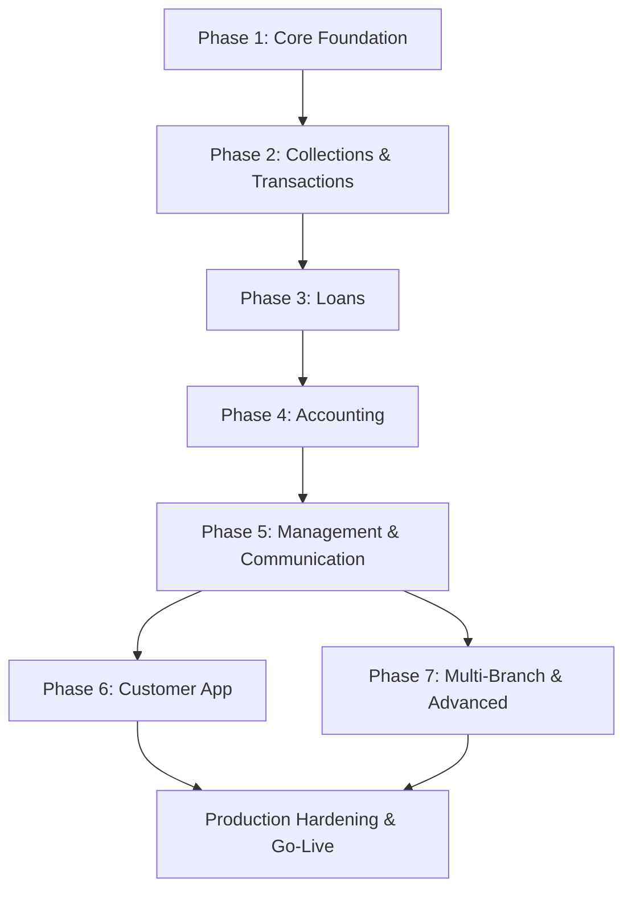

# Sanjeevani Finance Management System — Implementation Plan

> **SRS Reference:** [SANJEEVANI FINANCE MANAGEMENT SYSTEM.md](file:///c:/Users/HP/Desktop/sanjeevani%20Finance%20management%20system/SANJEEVANI%20FINANCE%20MANAGEMENT%20SYSTEM.md)

---

## Project Overview

A centralized digital finance management system replacing register-based operations. The system manages members, KYC, memberships, savings/RD/term-deposit products, loans, EMI schedules, collections, recovery, cash/bank, accounting, receipts, branches, employees, roles/permissions, audit logs, notifications, complaints, documents, MIS, and management dashboards.

**Core Principle:** _No software entry = no recognized transaction._

---

## User Review Required

> [!IMPORTANT]
> **Technology Stack Confirmation** — The SRS recommends **NestJS + TypeScript** (backend), **Next.js + React + TypeScript** (admin frontend), **Flutter** (mobile), **PostgreSQL** (database), **Redis** (cache), **S3-compatible storage** (files). Please confirm these choices or suggest alternatives.

> [!IMPORTANT]
> **MVP vs Full Build** — The SRS (§117) recommends an MVP-first approach. This plan follows the 7-phase structure from §97 but starts with the MVP scope. Please confirm you want to proceed phase-by-phase, or if you want a different ordering.

> [!WARNING]
> **Committee Module (§42) & Lucky-Draw Module (§44)** — These are flagged as feature-gated (`feature_flag = OFF`). They will be built with disabled-by-default flags. Confirm if you want these in Phase 1 schema or deferred entirely.

> [!CAUTION]
> **Regulatory/Compliance** — The SRS mentions `regulatory_status` on products (§13) and compliance restrictions (§17). You'll need to provide specific regulatory rules applicable to your jurisdiction for proper implementation.

---

## Open Questions

1. **Deployment Target**: Cloud provider preference? (AWS/GCP/Azure/self-hosted) — affects S3 storage, deployment configs, and CI/CD pipeline.
2. **SMS/WhatsApp Provider**: Which providers for notifications? (Twilio, MSG91, Gupshup, etc.)
3. **Payment Gateway**: Any UPI/bank integration needed for digital collections?
4. **Existing Data**: How much legacy register data needs migration? Approximate customer count?
5. **UI Library Preference**: SRS suggests Material UI / Ant Design / shadcn/ui — which do you prefer for the admin dashboard?
6. **Multi-tenancy**: Is this for a single organization (Sanjeevani) or should it support multiple organizations?
7. **Financial Year**: April–March (Indian standard) or calendar year?
8. **Currency**: INR only, or multi-currency support needed?

---

## Monorepo Structure (§6, §8)

```text
sanjeevani-finance/
├── apps/
│   ├── api/                    # NestJS Backend API
│   ├── admin-web/              # Next.js Admin Dashboard
│   ├── collection-mobile/      # Flutter Collection Staff App
│   └── customer-mobile/        # Flutter Customer App
├── packages/
│   ├── shared-types/           # Shared TypeScript types
│   ├── validation/             # Shared validation logic
│   └── financial-engine/       # EMI calculator, interest engine
├── docker/                     # Docker configs
├── tests/                      # E2E & integration tests
├── docs/                       # Documentation
└── scripts/                    # Utility scripts, migrations
```

---

## PHASE 1 — Core Foundation (§97 Phase 1)

_SRS Sections Covered: §1–§15, §43, §45–§52, §75–§78, §82–§84, §86, §94 (BR-001 to BR-020), §100–§111_

### 1.1 Project Initialization & Infrastructure

#### [NEW] Root project setup
- Initialize monorepo with `pnpm` workspaces or `turborepo`
- Configure TypeScript, ESLint, Prettier across all packages
- Docker Compose for PostgreSQL + Redis + MinIO (S3-compatible)
- Environment configuration files (§100: LOCAL, DEV, TEST, UAT, PROD)
- Git branching strategy (§101: main, develop, feature/*)
- CI/CD pipeline skeleton (§102)

#### [NEW] `apps/api/` — NestJS Backend
- `nest new api` with TypeScript strict mode
- Install core dependencies: `@nestjs/typeorm`, `typeorm`, `pg`, `@nestjs/config`, `@nestjs/bull`, `ioredis`, `class-validator`, `class-transformer`, `decimal.js`, `argon2`, `passport`, `@nestjs/jwt`
- Configure `app.module.ts` with global modules

#### [NEW] `apps/api/src/config/` — Configuration (§104)
- `app.config.ts` — company_name, financial_year, currency, timezone, prefixes
- `database.config.ts` — PostgreSQL connection with NUMERIC(18,2) for money (§75)
- `redis.config.ts` — sessions, OTP, caching, queues
- `storage.config.ts` — S3-compatible object storage

#### [NEW] `apps/api/src/common/` — Shared Infrastructure
- `decorators/` — `@CurrentUser`, `@Roles`, `@Permissions`, `@IdempotencyKey`
- `guards/` — `JwtAuthGuard`, `RolesGuard`, `PermissionsGuard`, `BranchAccessGuard`
- `interceptors/` — `AuditInterceptor`, `ResponseTransformInterceptor`, `IdempotencyInterceptor`
- `exceptions/` — Custom exceptions per §111 (CUSTOMER_NOT_FOUND, ACCOUNT_FROZEN, etc.)
- `filters/` — Global exception filter with standard error response format (§74)
- `middleware/` — `RequestIdMiddleware`, `RateLimitMiddleware`, `LoggingMiddleware`
- `validators/` — Custom validators for Indian mobile, PAN, Aadhaar, IFSC
- `enums/` — All status enums from the SRS
- `utils/` — `IdGenerator` for all identifier formats (§105)
- `constants/` — Business rule constants

---

### 1.2 Database Foundation

#### [NEW] Migration: `001_create_branches` (§12)
```
branches: id, branch_code, name, address, city, state, manager_id, phone, status, opened_at, created_at, deleted_at
```
- Index on `branch_code` (§109)
- Branch code format: `SJF-BR001`

#### [NEW] Migration: `002_create_users_roles_permissions` (§47 RBAC)
```
roles: id, name, description, is_system, created_at
permissions: id, name, module, action, description
role_permissions: role_id, permission_id
users: id, username, email, mobile, password_hash, is_active, is_2fa_enabled, branch_id, created_at
user_roles: user_id, role_id
```
- All permissions from §47: CUSTOMER_CREATE, CUSTOMER_EDIT, KYC_VERIFY, LOAN_CREATE, LOAN_RECOMMEND, LOAN_APPROVE, LOAN_DISBURSE, TRANSACTION_CREATE, TRANSACTION_APPROVE, TRANSACTION_REVERSE, CASH_CLOSE, REPORT_VIEW, AUDIT_VIEW, SETTINGS_EDIT
- Seed default roles from §3: Super Admin, General Manager, Branch Manager, Accountant, Cashier, Loan Officer, Recovery Officer, Collection Agent, Customer Service, Auditor, Customer

#### [NEW] Migration: `003_create_employees` (§45)
```
employees: id, employee_number, user_id, branch_id, name, mobile, email, designation, joining_date, salary, reporting_manager_id, employment_status, created_at, deleted_at
```
- Employee number: `SJF-EMP-000001`

#### [NEW] Migration: `004_create_customers` (§9)
```
customers: id, customer_number, branch_id, first_name, middle_name, last_name, father_or_spouse_name, date_of_birth, gender, mobile, alternate_mobile, email, address_line_1, address_line_2, city, state, postal_code, photo_url, joining_date, status, created_by, created_at, updated_at, deleted_at
```
- Indexes on: `customer_number`, `mobile` (§109)
- Customer number: `SJF-CUS-000001`
- Duplicate detection triggers for mobile, name+DOB (§90)

#### [NEW] Migration: `005_create_customer_kyc` (§10)
```
customer_kyc: id, customer_id, document_type, document_number, document_url, verification_status (PENDING/VERIFIED/REJECTED/EXPIRED), verified_by, verified_at, expiry_date, created_at
```
- KYC document_number must be encrypted/masked (§83: `PAN: ABCP****K`)

#### [NEW] Migration: `006_create_nominees` (§11)
```
nominees: id, customer_id, name, relationship, date_of_birth, mobile, address, percentage, created_at
```

#### [NEW] Migration: `007_create_documents` (§52)
```
documents: id, entity_type, entity_id, document_type, file_url, mime_type, version, uploaded_by, verified_by, created_at
```

#### [NEW] Migration: `008_create_products` (§13)
```
products: id, product_code, product_name, product_type (SAVINGS/RD/TERM_DEPOSIT/LOAN/COMMITTEE/OTHER), minimum_amount, maximum_amount, minimum_tenure, maximum_tenure, interest_method, interest_rate, penalty_method, premature_allowed, requires_nominee, regulatory_status (APPROVED/RESTRICTED/UNDER_REVIEW/DISABLED), is_enabled, effective_from, effective_to
```
- Business Rule BR-005: Disabled products cannot accept new accounts

#### [NEW] Migration: `009_create_accounts` (§14, §15)
```
accounts: id, account_number, customer_id, product_id, branch_id, opening_date, principal_amount, interest_rate, tenure, maturity_date, maturity_amount, current_balance, status (DRAFT/PENDING_APPROVAL/ACTIVE/FROZEN/MATURED/CLOSED/CANCELLED), created_by, approved_by, created_at, updated_at
```
- Indexes on: `account_number`, `customer_id`, `branch_id`, `status` (§109)
- Account number format: `SJF-RD-2026-000001`, `SJF-TD-2026-000001`

#### [NEW] Migration: `010_create_feature_flags` (§43)
```
feature_flags: id, feature_name, enabled, enabled_for_branch, approved_by, effective_date, remarks
```
- Seed defaults: RD_PRODUCT, TERM_DEPOSIT, COMMITTEE (OFF), LUCKY_DRAW (OFF), PREMATURE_WITHDRAWAL, LOAN_GUARANTOR, CASH_DISBURSEMENT

#### [NEW] Migration: `011_create_audit_logs` (§50, §51)
```
audit_logs: id, user_id, event_type, entity_type, entity_id, old_value (JSONB), new_value (JSONB), ip_address, device_id, timestamp, reason
login_audits: id, user_id, event (login/logout/failed), ip_address, device, user_agent, session_id, timestamp
```
- Business Rule BR-011: Audit logs are immutable — no UPDATE/DELETE on this table

#### [NEW] Migration: `012_create_settings` (§104)
```
system_settings: id, key, value, category, updated_by, updated_at
```
- Seed: company_name, financial_year, currency (INR), timezone (Asia/Kolkata), receipt_prefix, loan_number_prefix, customer_prefix, maker_checker_threshold, daily_closing_time, password_policy

---

### 1.3 Backend Modules — Phase 1

Each module follows the standard structure from §7:
```
module-name/
├── module-name.module.ts
├── module-name.controller.ts
├── module-name.service.ts
├── dto/
├── entities/
├── repositories/
├── policies/
└── tests/
```

#### [NEW] `modules/auth/` — Authentication (§46)
- Login with username/email/mobile + password
- JWT access token + refresh token
- OTP/2FA for privileged actions
- Step-up authentication for sensitive operations
- Password hashing with Argon2 (§82)
- Session management via Redis
- Rate limiting on login attempts
- **APIs** (§73):
  - `POST /api/v1/auth/login`
  - `POST /api/v1/auth/refresh`
  - `POST /api/v1/auth/logout`
  - `POST /api/v1/auth/otp/verify`

#### [NEW] `modules/users/` — User Management
- CRUD for system users
- Link to employees
- Branch-level access control (BR-014)

#### [NEW] `modules/roles/` — Role Management (§47)
- CRUD for roles and permissions
- Role-permission assignment
- User-role assignment

#### [NEW] `modules/permissions/` — Permission Management
- Permission seeding and management
- Permission checking guards

#### [NEW] `modules/branches/` — Branch Management (§12)
- CRUD for branches
- Branch status management
- Manager assignment
- Branch-scoped data access enforcement

#### [NEW] `modules/employees/` — Employee Management (§45)
- CRUD for employees
- Reporting hierarchy
- Employment status tracking
- Employee number generation (`SJF-EMP-000001`)

#### [NEW] `modules/customers/` — Customer Management (§9)
- **APIs** (§73):
  - `POST /api/v1/customers` — Create customer with auto-generated ID
  - `GET /api/v1/customers` — List with pagination, search, filters
  - `GET /api/v1/customers/:id` — Customer 360 view (§69)
  - `PATCH /api/v1/customers/:id` — Update (audit logged, BR-015)
  - `GET /api/v1/customers/:id/accounts` — All accounts
  - `GET /api/v1/customers/:id/transactions` — Transaction history
  - `GET /api/v1/customers/:id/statements` — Statements
- Customer number generation: `SJF-CUS-000001` (BR-001)
- Duplicate detection (§90): mobile, PAN/KYC ID, name+DOB, name+father+address
- Soft delete support (§110)

#### [NEW] `modules/kyc/` — KYC Management (§10)
- Upload KYC documents
- Verify/reject KYC
- Track verification status workflow: PENDING → VERIFIED/REJECTED
- Expiry date tracking
- Data masking for non-privileged users (§83)
- **API**: `POST /api/v1/customers/:id/kyc`

#### [NEW] `modules/nominees/` — Nominee Management (§11)
- CRUD for nominees per customer
- Percentage allocation (must sum to 100%)

#### [NEW] `modules/documents/` — Document Management (§52)
- Upload to S3-compatible storage
- Polymorphic entity linking (entity_type + entity_id)
- Versioning
- Verification workflow
- Malware scanning placeholder (§82)

#### [NEW] `modules/products/` — Product Master (§13)
- **APIs** (§73):
  - `GET /api/v1/products` — List active products
  - `POST /api/v1/products` — Create product
  - `PATCH /api/v1/products/:id` — Update product
- Product type support: SAVINGS, RD, TERM_DEPOSIT, LOAN, COMMITTEE, OTHER
- Regulatory status enforcement (BR-005, BR-019)
- Configurable interest methods, penalties, tenure ranges

#### [NEW] `modules/audit/` — Audit Module (§50, §51)
- Automatic audit logging via interceptor
- Login/logout tracking
- Query audit trail by user, entity, date range
- Immutable — no edit/delete endpoints (BR-011)

#### [NEW] `modules/settings/` — System Settings (§104)
- Key-value configuration store
- Company name, financial year, currency, timezone
- Identifier prefixes
- Password policy
- Maker-checker threshold

---

### 1.4 Admin Frontend Foundation (§8)

#### [NEW] `apps/admin-web/` — Next.js Setup
- Initialize with `npx create-next-app@latest`
- TypeScript, App Router
- UI library setup (shadcn/ui or Ant Design — pending confirmation)
- Global layout with sidebar navigation (§96)
- Authentication pages (login, 2FA)
- API service layer (`services/api.ts`, `services/auth.ts`)
- Role-based route protection
- Responsive design

#### [NEW] Admin navigation structure (§96):
```
Dashboard
Customers
Accounts (Savings / RD / Term Deposits)
Loans (Applications / Verification / Approval / Active / EMI / Overdue)
Collections (Today / Routes / Collectors / Reconciliation)
Cash & Bank (Cash Drawer / Bank Accounts / Reconciliation)
Accounting (Chart of Accounts / Journals / Ledgers / Expenses / Statements)
Recovery
Employees
Branches
Complaints
Reports
Audit
Notifications
Settings
```

#### [NEW] Core pages for Phase 1:
- `app/login/` — Login page
- `app/dashboard/` — Placeholder dashboard
- `app/customers/` — Customer list, create, detail (Customer 360 — §69)
- `app/employees/` — Employee management
- `app/settings/` — System settings
- `app/audit/` — Audit log viewer

#### [NEW] Shared components:
- DataTable with pagination, sorting, filtering
- Form components with validation
- Search bar (§107: by Customer ID, Name, Mobile, Account, Loan, Receipt, TXN)
- Status badges
- Confirmation dialogs
- Receipt viewer

---

### 1.5 Shared Packages

#### [NEW] `packages/shared-types/`
- All TypeScript interfaces matching database entities
- Enum definitions
- API request/response types (§74)
- Standard response format: `{ success, data, message, requestId }`

#### [NEW] `packages/validation/`
- Shared validation rules (Indian mobile, PAN, Aadhaar, IFSC)
- Amount validation (positive, within product limits)

#### [NEW] `packages/financial-engine/`
- `Decimal.js` based money calculations (§75)
- EMI calculator placeholder (fully built in Phase 3)
- Interest calculation utilities

---

## PHASE 2 — Collections & Transactions (§97 Phase 2)

_SRS Sections Covered: §14–§21, §31–§35, §63–§64, §71, §77_

### 2.1 Database Migrations

#### [NEW] Migration: `013_create_transactions` (§16)
```
transactions: id, transaction_number, branch_id, customer_id, account_id, transaction_type, amount NUMERIC(18,2), payment_mode, transaction_date, reference_number, status, created_by, approved_by, reversal_of_transaction_id, remarks, created_at, approved_at, version (for optimistic locking §78)
```
- Transaction types: DEPOSIT, WITHDRAWAL, INSTALLMENT, LOAN_DISBURSEMENT, EMI_PAYMENT, INTEREST_CREDIT, PENALTY, FEE, REFUND, REVERSAL, ADJUSTMENT
- Immutable transaction rule (§17): approved transactions NEVER deleted, corrections via REVERSAL
- Idempotency key support (§77)
- Indexes: `transaction_number`, `transaction_date`, `branch_id`, `customer_id`, `account_id` (§109)
- Concurrency locking with `version` column (§78)

#### [NEW] Migration: `014_create_receipts` (§18)
```
receipts: id, receipt_number, transaction_id, customer_id, amount, payment_mode, collector_id, generated_at, pdf_url, delivery_status
```
- Receipt number: `SJF-RCP-2026-00000001`

#### [NEW] Migration: `015_create_rd_accounts` (§19)
```
rd_accounts: id, account_id, installment_amount, frequency, total_installments, paid_installments, next_due_date, late_fee, maturity_amount, status
```

#### [NEW] Migration: `016_create_rd_installments` (§20)
```
rd_installments: id, rd_account_id, installment_number, due_date, amount_due, amount_paid, paid_at, status (UPCOMING/DUE/PARTIAL/PAID/OVERDUE/WAIVED)
```

#### [NEW] Migration: `017_create_term_deposits` (§21)
```
term_deposits: id, account_id, principal, interest_rate, interest_method, start_date, maturity_date, maturity_amount, premature_rate, nominee_id, certificate_number, status
```

#### [NEW] Migration: `018_create_collection_assignments` (§31)
```
collection_assignments: id, collector_id, customer_id, route_id, assigned_date, expected_amount, status
```

#### [NEW] Migration: `019_create_routes` (§71)
```
routes: id, route_name, branch_id, collector_id, area, sequence
```

#### [NEW] Migration: `020_create_cash_drawers` (§34)
```
cash_drawers: id, branch_id, cashier_id, business_date, opening_balance, cash_received, cash_paid, expected_closing_balance, physical_closing_balance, difference, status (OPEN/PENDING_RECONCILIATION/MATCHED/MISMATCH/APPROVED_WITH_EXCEPTION/CLOSED), closed_by, approved_by
```

#### [NEW] Migration: `021_create_business_day_closures` (§64)
```
business_day_closures: id, branch_id, business_date, status (OPEN/CLOSING/PENDING_APPROVAL/LOCKED/REOPENED), closed_by, approved_by, closed_at
```

---

### 2.2 Backend Modules — Phase 2

#### [NEW] `modules/accounts/` — Account Management
- Open account (linked to product, requires product.regulatory_status === APPROVED)
- Account status workflow: DRAFT → PENDING_APPROVAL → ACTIVE → MATURED/CLOSED
- Balance tracking with pessimistic locking (`SELECT ... FOR UPDATE` — §78)
- Account number generation per product type

#### [NEW] `modules/rd/` — RD Module (§19, §20)
- Create RD account with installment schedule generation
- Auto-calculate due dates based on frequency
- Track paid/overdue installments
- Late fee calculation
- Maturity calculation

#### [NEW] `modules/term-deposits/` — Term Deposit Module (§21)
- Create term deposit with maturity calculation
- Interest method support (simple/compound)
- Premature withdrawal (if allowed by product & feature flag)
- Certificate number generation

#### [NEW] `modules/transactions/` — Transaction Engine (§16, §17)
- **APIs** (§73):
  - `POST /api/v1/transactions` — Create transaction
  - `GET /api/v1/transactions/:id` — Get transaction details
  - `POST /api/v1/transactions/:id/approve` — Approve (maker-checker)
  - `POST /api/v1/transactions/:id/reverse` — Reverse transaction
- Database transaction wrapping (§76: BEGIN → operations → COMMIT/ROLLBACK)
- Idempotency key header support (§77)
- Concurrency control (§78)
- NEVER delete approved transactions (BR-002, BR-018)
- Reversal workflow (§17): Original → Reversal → Correct Entry

#### [NEW] `modules/receipts/` — Receipt Module (§18)
- Auto-generate receipt on successful payment (BR-013)
- PDF generation
- Receipt number: `SJF-RCP-2026-00000001`
- Delivery status tracking (for SMS/WhatsApp sending)

#### [NEW] `modules/collections/` — Collection Module (§31, §32)
- **APIs** (§73):
  - `GET /api/v1/collections/today` — Today's due list for collector
  - `POST /api/v1/collections` — Record collection
  - `GET /api/v1/collectors/:id/reconciliation` — Reconciliation summary
  - `POST /api/v1/collectors/:id/close-day` — Close collector's day
- Daily collection workflow (§32): Login → Customer List → Visit → Collect → Receipt → Notification
- Cash collection reconciliation (§33): Total Collected − Cash Deposited = Difference
- Collector cannot close shift with unexplained difference (§33)
- Collection assignment management

#### [NEW] `modules/cash/` — Cash Drawer Management (§34, §35)
- Opening/closing cash drawer per business day
- Cash receipt and payment tracking
- Expected vs physical balance reconciliation
- Status workflow: OPEN → PENDING_RECONCILIATION → MATCHED/MISMATCH → CLOSED
- BR-006: Cash drawer must reconcile daily

#### [NEW] `modules/reconciliation/` — Daily Closing (§63, §64)
- Daily closing workflow (§63): Collection → Collector Recon → Cashier Recon → Bank Check → Pending Review → Ledger Post → Mismatch Check → Manager Approval → Date Lock
- Business date lock (§64): OPEN → CLOSING → PENDING_APPROVAL → LOCKED
- BR-009: Business date must be closed daily
- BR-010: Closed day cannot be edited without authorized reopening

---

### 2.3 Admin Frontend — Phase 2

#### [NEW] Pages:
- `app/accounts/` — Account list, create, detail
- `app/rd/` — RD accounts, installment schedule view
- `app/deposits/` — Term deposit management
- `app/collections/` — Today's collection, collector views, reconciliation
- `app/transactions/` — Transaction search, detail, approval queue

---

## PHASE 3 — Loans (§97 Phase 3)

_SRS Sections Covered: §22–§30, §56–§58_

### 3.1 Database Migrations

#### [NEW] Migration: `022_create_loan_applications` (§22, §23)
```
loan_applications: id, application_number, customer_id, branch_id, loan_product_id, requested_amount, requested_tenure, purpose, declared_income, existing_liabilities, credit_score_internal, status, created_by, created_at
```
- Status workflow (§23): DRAFT → SUBMITTED → KYC_PENDING → DOCUMENT_PENDING → FIELD_VERIFICATION → CREDIT_REVIEW → MANAGER_REVIEW → APPROVED/REJECTED → SANCTIONED → AGREEMENT_PENDING → READY_FOR_DISBURSEMENT → DISBURSED → CANCELLED

#### [NEW] Migration: `023_create_credit_assessments` (§24)
```
credit_assessments: id, loan_application_id, kyc_score, income_score, repayment_score, liability_score, security_score, banking_score, field_score, total_score, risk_category (LOW/MEDIUM/HIGH/VERY_HIGH), recommendation, assessed_by, assessed_at
```

#### [NEW] Migration: `024_create_loans` (§25)
```
loans: id, loan_number, customer_id, loan_application_id, principal NUMERIC(18,2), annual_interest_rate, interest_method (FLAT_RATE/REDUCING_BALANCE/CUSTOM_SCHEDULE), tenure_months, emi_amount, disbursement_date, first_due_date, final_due_date, outstanding_principal, status, created_at
```
- Loan number: `SJF-LN-2026-000001`

#### [NEW] Migration: `025_create_loan_installments` (§27, §28)
```
loan_installments: id, loan_id, installment_number, due_date, opening_principal, principal_due, interest_due, fee_due, penalty_due, total_due, amount_paid, principal_paid, interest_paid, closing_principal, status (UPCOMING/DUE/PARTIAL/PAID/OVERDUE/WAIVED/RESTRUCTURED)
```
- Indexes: `loan_id`, `due_date`, `status` (§109)

#### [NEW] Migration: `026_create_guarantors`
```
guarantors: id, loan_application_id, customer_id, relationship, guarantee_amount, status
```

#### [NEW] Migration: `027_create_approval_limits` (§30)
```
approval_limits: id, role_id, transaction_type, minimum_amount, maximum_amount, approval_level
```
- Seed configurable limits: Loan Officer (₹0–₹25K Recommend), Branch Manager (₹25K–₹1L Approve), GM (₹1L–₹3L), Director (>₹3L)

#### [NEW] Migration: `028_create_recovery_cases` (§56, §57)
```
recovery_cases: id, loan_id, days_past_due, overdue_amount, bucket (CURRENT/1-30/31-60/61-90/90+), assigned_to, priority, next_action_date, status
```

#### [NEW] Migration: `029_create_recovery_actions` (§58)
```
recovery_actions: id, recovery_case_id, action_type (CALL/SMS/WHATSAPP/FIELD_VISIT/PROMISE_TO_PAY/PAYMENT_RECEIVED/ESCALATION/LEGAL_REVIEW), action_date, notes, promise_amount, promise_date, next_follow_up, created_by
```

---

### 3.2 Backend Modules — Phase 3

#### [NEW] `modules/loan-applications/` — Loan Application (§22, §23)
- **APIs** (§73):
  - `POST /api/v1/loan-applications` — Create application
  - `GET /api/v1/loan-applications/:id` — Get details
  - `POST /api/v1/loan-applications/:id/submit` — Submit
  - `POST /api/v1/loan-applications/:id/verification` — Field verification
  - `POST /api/v1/loan-applications/:id/credit-assessment` — Credit assessment
  - `POST /api/v1/loan-applications/:id/recommend` — Recommend
  - `POST /api/v1/loan-applications/:id/approve` — Approve
  - `POST /api/v1/loan-applications/:id/reject` — Reject
- Full status workflow enforcement (§23)
- Application number: `SJF-LA-2026-000001`

#### [NEW] `modules/credit-assessment/` — Credit Assessment (§24)
- Multi-factor scoring: KYC, income, repayment, liability, security, banking, field
- Total score calculation
- Risk category assignment (LOW/MEDIUM/HIGH/VERY_HIGH)
- Recommendation generation

#### [NEW] `modules/guarantors/` — Guarantor Management
- Link guarantors to loan applications
- Feature flag controlled (`LOAN_GUARANTOR`)

#### [NEW] `modules/loans/` — Loan Management (§25, §29)
- **APIs** (§73):
  - `POST /api/v1/loans/:id/disburse` — Disburse loan
  - `GET /api/v1/loans/:id/schedule` — EMI schedule
  - `GET /api/v1/loans/:id/payments` — Payment history
- Disbursement workflow (§29): Approved → Sanction → Acceptance → Agreement → Verification → Disbursement Request → Maker Creates → Checker Approves → Bank/Cash Disbursement → Loan Activated → EMI Schedule Generated
- BR-007: Cannot disburse without required approvals
- BR-008: Loan schedule must exist before activation

#### [NEW] `modules/emi/` — EMI Engine (§26, §27)
- **Calculators** (§26):
  - FLAT_RATE: `EMI = (P + P*r*n) / n`
  - REDUCING_BALANCE: `EMI = P × r × (1+r)^n / ((1+r)^n - 1)` — using Decimal.js
  - CUSTOM_SCHEDULE: Manual schedule entry
- Schedule generation with opening/closing principal tracking
- Overdue detection and penalty calculation
- Never use JavaScript floating-point for money (§75)

#### [NEW] `modules/approvals/` — Approval Engine (§48, §49)
- Generic approval table (§49): entity_type, entity_id, action, amount, maker_id, required_role, status
- Maker-checker enforcement (§48): `maker_user_id != checker_user_id` (BR-004)
- Configurable approval limits (§30)
- Supports: Loans, Withdrawals, Reversals, Account closures, Interest adjustments, Refunds, Cash discrepancies, Expenses (BR-020)

#### [NEW] `modules/recovery/` — Recovery Module (§56, §57, §58)
- Auto-create recovery cases for overdue loans
- Bucket classification: CURRENT, 1–30, 31–60, 61–90, 90+
- Recovery officer assignment
- Action tracking: calls, visits, promise-to-pay, escalation
- Follow-up scheduling

---

### 3.3 Admin Frontend — Phase 3

#### [NEW] Pages:
- `app/loans/` — All loan sub-pages:
  - Applications list & create
  - Verification workflow
  - Credit assessment form
  - Approval queue
  - Active loans list
  - EMI schedule view
  - Overdue list
  - Disbursement workflow
- `app/recovery/` — Recovery case list, action history, follow-ups

---

## PHASE 4 — Accounting (§97 Phase 4)

_SRS Sections Covered: §36–§41, §59–§60_

### 4.1 Database Migrations

#### [NEW] Migration: `030_create_bank_accounts` (§36)
```
bank_accounts: id, branch_id, bank_name, account_name, masked_account_number, ifsc, opening_balance, current_book_balance, status
```

#### [NEW] Migration: `031_create_bank_reconciliations` (§37)
```
bank_reconciliations: id, bank_account_id, statement_date, book_balance, statement_balance, unmatched_credits, unmatched_debits, difference, status, prepared_by, approved_by
```

#### [NEW] Migration: `032_create_chart_of_accounts` (§39)
```
chart_of_accounts: id, account_code, account_name, account_type (ASSET/LIABILITY/EQUITY/INCOME/EXPENSE), parent_id, is_active
```
- Seed standard chart of accounts for finance company

#### [NEW] Migration: `033_create_journal_entries` (§40)
```
journal_entries: id, journal_number, transaction_id, business_date, description, status, created_by, approved_by
```

#### [NEW] Migration: `034_create_journal_lines` (§41)
```
journal_lines: id, journal_entry_id, ledger_account_id, debit_amount NUMERIC(18,2), credit_amount NUMERIC(18,2), branch_id, customer_id, account_id
```
- **CRITICAL**: Every journal must satisfy `SUM(DEBIT) = SUM(CREDIT)` (BR-016)
- System must reject unbalanced journals

#### [NEW] Migration: `035_create_expenses` (§59)
```
expenses: id, branch_id, category_id, amount, description, payment_mode, voucher_number, receipt_url, created_by, approved_by, expense_date
```

#### [NEW] Migration: `036_create_salary_runs` (§60)
```
salary_runs: id, month, year, employee_id, basic_salary, incentive, deductions, net_salary, status
```

---

### 4.2 Backend Modules — Phase 4

#### [NEW] `modules/accounting/` — Accounting Engine (§38)
- Double-entry accounting for every financial event
- Auto-generate journal entries from transactions
- Examples:
  - Loan disbursement: `Dr Loan Receivable ₹100,000 / Cr Bank ₹100,000`
  - Loan repayment: `Dr Bank ₹10,000 / Cr Loan Principal ₹8,000 / Cr Interest Income ₹2,000`
- Journal balance validation (reject unbalanced)

#### [NEW] `modules/ledger/` — General Ledger (§39)
- Chart of accounts CRUD
- Hierarchical account structure (parent_id)
- Ledger balance calculation
- Trial balance generation
- P&L statement generation
- Balance sheet generation

#### [NEW] `modules/journal/` — Journal Engine (§40, §41)
- Journal entry CRUD with approval workflow
- Journal line creation with balance validation
- Link to source transactions

#### [NEW] `modules/banks/` — Bank Account Management (§36, §37)
- Bank account CRUD
- Book balance tracking
- Bank reconciliation workflow
- Statement upload and matching

#### [NEW] `modules/expenses/` — Expense Management (§59)
- Expense recording with approval workflow
- Category management
- Voucher tracking
- Journal entry auto-generation

#### [NEW] `modules/payroll/` — Payroll (§60)
- Monthly salary run
- Incentive and deduction calculation
- Net salary computation
- Approval workflow
- Journal entry generation for salary

---

### 4.3 Admin Frontend — Phase 4

#### [NEW] Pages:
- `app/accounting/` — Chart of accounts, journal entries, ledger views
- Financial statements: Trial Balance, P&L, Balance Sheet
- `app/cash-bank/` — Cash drawer, bank accounts, bank reconciliation

---

## PHASE 5 — Management & Communication (§97 Phase 5)

_SRS Sections Covered: §53–§55, §61–§62, §65–§68, §79–§81, §113_

### 5.1 Backend Modules — Phase 5

#### [NEW] `modules/dashboards/` — Owner Dashboard (§65, §66, §67)
- Dashboard cards (§65): Total Members, Active Members, Total Active Accounts, Total Collection Today/Month, Total Loan Outstanding, New Loan Disbursement, EMI Due/Collected Today, Total Overdue, Overdue %, Cash in Hand, Bank Balance, Income, Expense, Net Result, Mismatch Amount
- Charts (§66): Monthly Collection Trend, Loan Disbursement Trend, Outstanding, Overdue Aging, Branch Performance, Collector Performance, Cash vs Bank, Product Distribution, Income vs Expense
- Red Alert Dashboard (§67): Cash mismatch, Bank recon mismatch, Unapproved high-value TXN, KYC incomplete, Loan overdue > X days, Maturity approaching, Failed logins, Manual adjustments, Reversals, Backdated TXN, Duplicate mobile/customer

#### [NEW] `modules/reports/` — Reporting Module (§68, §106)
- All mandatory reports from §68:
  - Customer Master, Customer Statement, Account Statement
  - Daily Collection, Collector Summary
  - Cash Book, Bank Book, Bank Reconciliation, Daily Closing
  - RD Due, RD Overdue, Deposit Maturity
  - Loan Application, Loan Disbursement, Loan Outstanding
  - EMI Schedule, EMI Due, Overdue Aging
  - Recovery Report, Expense Report, Income Report
  - Trial Balance, P&L, Balance Sheet
  - Audit Trail, User Activity, Branch Performance
- **APIs** (§73):
  - `GET /api/v1/reports/daily-collection`
  - `GET /api/v1/reports/loan-outstanding`
  - `GET /api/v1/reports/overdue-aging`
  - `GET /api/v1/reports/cash-book`
  - `GET /api/v1/reports/trial-balance`
  - `GET /api/v1/reports/profit-loss`
- Export formats (§106): PDF, Excel, CSV
- Report metadata: Generated by, Generated time, Branch, Filters, Page numbering

#### [NEW] `modules/complaints/` — Complaint Management (§53)
- CRUD for complaints
- Status workflow: OPEN → ASSIGNED → IN_PROGRESS → RESOLVED → CLOSED → REOPENED
- Priority management
- Assignment tracking
- Resolution recording
- Complaint number: `SJF-CMP-2026-000001`

#### [NEW] `modules/notifications/` — Notification Engine (§54, §55)
- Multi-channel: SMS, WhatsApp, Email, Push
- Template management
- Scheduled and immediate sending
- Delivery status tracking
- Automatic notification events (§55): PAYMENT_RECEIVED, EMI_DUE, EMI_OVERDUE, RD_DUE, MATURITY_UPCOMING, LOAN_APPROVED, LOAN_REJECTED, LOAN_DISBURSED, ACCOUNT_OPENED, ACCOUNT_CLOSED, COMPLAINT_CREATED, COMPLAINT_RESOLVED

#### [NEW] `modules/attendance/` — Staff Attendance
- Basic attendance tracking for branch staff

#### [NEW] Event Architecture (§79)
- Internal event system using NestJS EventEmitter + BullMQ
- Events: PaymentReceived, LoanApproved, LoanDisbursed, EMIDue, EMIOverdue, AccountMatured, CustomerCreated, ComplaintCreated
- Event cascade (§79): PaymentReceived → Update Account → Accounting Entry → Generate Receipt → Send WhatsApp → Update Dashboard

#### [NEW] Background Jobs (§80, §81)
- BullMQ + Redis job queue
- Jobs: EMI reminders, RD reminders, maturity calculation, monthly statements, notifications, overdue bucket updates, daily MIS, backups, PDF report generation
- Nightly schedule (§81):
  - 00:05 — Validate business closing
  - 00:15 — Update overdue statuses
  - 00:30 — Generate tomorrow's due list
  - 01:00 — Generate dashboards
  - 01:30 — Backup
  - 02:00 — Data integrity checks

#### [NEW] KPI Modules (§61, §62)
- Collection Agent KPI (§61): Expected vs Actual Collection, Collection %, Overdue Recovery, Cash Difference, Receipt Accuracy, Customer Complaints
- Loan Officer KPI (§62): Applications, Approval Rate, Disbursement, 30/90-day delinquency, Portfolio Outstanding, Recovery Performance

---

### 5.2 Admin Frontend — Phase 5

#### [NEW] Pages:
- `app/dashboard/` — Full owner dashboard with cards + charts + red alerts
- `app/reports/` — Report listing with filters and export
- `app/complaints/` — Complaint management
- `app/notifications/` — Notification history and templates

---

## PHASE 6 — Customer App (§97 Phase 6)

_SRS Sections Covered: §72_

#### [NEW] `apps/customer-mobile/` — Flutter Customer App (§72)
- Screens: Login, Dashboard, Profile, Accounts, RD, Deposits, Loans, EMI Schedule, Payment History, Receipts, Statements, Notifications, Service Requests, Complaints, Help
- Read-only access to own data (§3.11)
- Push notification integration

---

## PHASE 7 — Multi-Branch Scaling & Advanced Features (§97 Phase 7)

_SRS Sections Covered: §42, §44, §85, §87–§89, §113_

#### [NEW] Multi-branch features
- Branch-level data isolation
- Centralized approval workflows
- Branch MIS
- Inter-branch transfers
- Regional management views

#### [NEW] Committee Module (§42) — Feature-flagged
```
committee_groups, committee_members, committee_installments
```
- Feature flag: OFF by default

#### [NEW] Lucky-Draw Module (§44) — Feature-flagged
```
promotional_programs, program_members, entries, draws, winners, audit_logs
```
- Feature flag: disabled by default

#### [NEW] Data Migration System (§87, §88, §89)
- Import template for existing registers (§88)
- Validation pipeline (§87): Register → Excel Template → Validation → Duplicate Detection → Supervisor Verification → Import → Customer Confirmation → Opening Balance Approval → Lock
- Opening balance control (§89): OPENING_BALANCE entry with source register, page number, entered by, verified by, approval date

#### [NEW] Fraud/Risk Alert Engine (§113) — Future
- Rule-based alerts: Multiple reversals, backdated TXN, large cash TXN, repeated adjustments, same-mobile accounts, unusual collections, cash mismatch, large loan override, instant loan approval, unusual login device

#### [NEW] Disaster Recovery (§85)
- RPO ≤ 15 minutes, RTO ≤ 4 hours
- Continuous DB backup, daily/weekly/monthly snapshots
- Encrypted backups (§84)
- Restoration testing

---

## Cross-Cutting Concerns (Applied Across All Phases)

| Concern | SRS Section | Implementation |
|---------|-------------|----------------|
| Money calculations | §75 | `Decimal.js` backend, `NUMERIC(18,2)` DB |
| DB transactions | §76 | TypeORM `QueryRunner` with BEGIN/COMMIT/ROLLBACK |
| Idempotency | §77 | `Idempotency-Key` header interceptor |
| Concurrency | §78 | `SELECT ... FOR UPDATE` + optimistic versioning |
| Immutable TXN | §17, BR-002 | No DELETE on transactions, reversal only |
| Maker-Checker | §48, BR-004 | `maker_user_id != checker_user_id` |
| Audit logs | §50, BR-011 | Immutable, auto-captured via interceptor |
| Soft delete | §110 | `deleted_at` for non-financial data only |
| Data masking | §83 | Field-level masking for sensitive data by role |
| Error handling | §111 | Custom exception codes |
| Structured logging | §86 | request_id, user_id, branch_id, action, duration |
| Security | §82 | HTTPS, Argon2, 2FA, RBAC, encryption, rate limiting |
| API format | §74 | `{ success, data/error, message, requestId }` |
| Search | §107 | Global search across Customer ID, Name, Mobile, Account, Loan, Receipt, TXN |
| Indexes | §109 | On all frequently queried columns |
| Performance | §108 | Target: 50K customers, 500 concurrent staff, 1M+ TXN, 50 branches |

---

## Business Rules Checklist (§94)

| Rule | Description | Enforced In |
|------|-------------|-------------|
| BR-001 | No customer without unique ID | Customer module |
| BR-002 | No approved TXN can be deleted | Transaction module |
| BR-003 | Financial correction requires reversal | Transaction module |
| BR-004 | Maker cannot approve own restricted TXN | Approval module |
| BR-005 | Disabled products cannot accept new accounts | Product/Account modules |
| BR-006 | Cash drawer must reconcile daily | Cash module |
| BR-007 | Loan cannot be disbursed without approvals | Loan module |
| BR-008 | Loan schedule must exist before activation | EMI module |
| BR-009 | Business date must be closed daily | Reconciliation module |
| BR-010 | Closed day cannot be edited without reopening | Business day closure |
| BR-011 | Audit logs are immutable | Audit module |
| BR-012 | Every payment generates a TXN number | Transaction module |
| BR-013 | Every successful payment produces a receipt | Receipt module |
| BR-014 | Branch users cannot access other branches | Branch access guard |
| BR-015 | Sensitive changes require reason | Audit interceptor |
| BR-016 | All ledger entries must balance | Journal module |
| BR-017 | Prevent duplicate payment via idempotency | Idempotency interceptor |
| BR-018 | Deleted financial records prohibited | DB constraints |
| BR-019 | Product permissions by compliance config | Feature flags |
| BR-020 | High-value operations require approval | Approval engine |

---

## 🔒 PRODUCTION SECURITY HARDENING (§82 Expanded)

> [!CAUTION]
> This system handles real money and personal financial data for your client's customers. Every item below is **mandatory** for production deployment.

### A. Application Security — OWASP Top 10 Compliance

| Threat | Protection | Implementation |
|--------|-----------|----------------|
| **A01 Broken Access Control** | RBAC + branch isolation + maker-checker | Guards, policies, DB-level row security |
| **A02 Cryptographic Failures** | AES-256 encryption for KYC data at rest | `crypto` module + DB column-level encryption |
| **A03 Injection (SQL/NoSQL/XSS)** | Parameterized queries via TypeORM, input sanitization | `class-validator`, `class-transformer`, `sanitize-html` |
| **A04 Insecure Design** | Threat modeling, business rule enforcement | All 20 BR rules enforced at service layer |
| **A05 Security Misconfiguration** | Helmet.js, strict CORS, CSP headers | NestJS middleware pipeline |
| **A06 Vulnerable Components** | Automated dependency scanning | `npm audit`, Snyk/Dependabot in CI |
| **A07 Auth Failures** | Argon2 hashing, JWT rotation, 2FA, account lockout | Auth module + Redis-based lockout |
| **A08 Data Integrity Failures** | Signed JWTs, integrity checks, code signing | JWT RS256, Docker image signing |
| **A09 Logging & Monitoring Failures** | Structured logging, alerting, audit trail | Winston + ELK/CloudWatch + alert rules |
| **A10 SSRF** | URL validation, no user-controlled URLs in backend requests | Allowlist-based URL validation |

### B. HTTP Security Headers

```typescript
// Applied globally via Helmet.js in main.ts
app.use(helmet({
  contentSecurityPolicy: {
    directives: {
      defaultSrc: ["'self'"],
      scriptSrc: ["'self'"],
      styleSrc: ["'self'", "'unsafe-inline'"],
      imgSrc: ["'self'", "data:", "blob:"],
      connectSrc: ["'self'"],
      fontSrc: ["'self'"],
      objectSrc: ["'none'"],
      frameAncestors: ["'none'"],
    }
  },
  crossOriginEmbedderPolicy: true,
  crossOriginOpenerPolicy: true,
  crossOriginResourcePolicy: { policy: "same-origin" },
  dnsPrefetchControl: true,
  frameguard: { action: "deny" },
  hsts: { maxAge: 31536000, includeSubDomains: true, preload: true },
  ieNoOpen: true,
  noSniff: true,
  referrerPolicy: { policy: "strict-origin-when-cross-origin" },
  xssFilter: true,
}));
```

### C. CORS Configuration

```typescript
app.enableCors({
  origin: [process.env.ADMIN_WEB_URL, process.env.CUSTOMER_APP_URL],
  methods: ['GET', 'POST', 'PATCH', 'DELETE'],
  allowedHeaders: ['Content-Type', 'Authorization', 'Idempotency-Key', 'X-Request-ID'],
  credentials: true,
  maxAge: 86400,
});
```

### D. Authentication Hardening (§46, §82)

| Feature | Implementation |
|---------|----------------|
| **Password Hashing** | Argon2id (time=3, memory=64MB, parallelism=4) |
| **Password Policy** | Min 10 chars, uppercase, lowercase, number, special char |
| **Password History** | Store last 5 hashes, prevent reuse |
| **Password Expiry** | Configurable (default 90 days) |
| **Account Lockout** | Lock after 5 failed attempts for 30 minutes |
| **Brute Force Protection** | Progressive delays: 1s, 2s, 4s, 8s, 16s... |
| **JWT Access Token** | RS256 signed, 15-minute expiry |
| **JWT Refresh Token** | Rotated on each use, 7-day expiry, stored in Redis |
| **Session Management** | Max 3 concurrent sessions per user, force logout older |
| **2FA/OTP** | TOTP (Google Authenticator) or SMS OTP for privileged actions |
| **Step-Up Auth** | Re-authentication required for: loan approval, disbursement, reversal, settings change, user management |
| **Cookie Security** | `httpOnly: true, secure: true, sameSite: 'strict', path: '/'` |

### E. Data Encryption

| Data | At Rest | In Transit |
|------|---------|------------|
| **KYC Documents** | AES-256-GCM encrypted in S3 | TLS 1.3 |
| **Aadhaar/PAN Numbers** | Column-level encryption in PostgreSQL | TLS 1.3 |
| **Passwords** | Argon2id hash (irreversible) | TLS 1.3 |
| **Database Backups** | AES-256 encrypted before storage | TLS 1.3 |
| **API Traffic** | N/A | TLS 1.3 mandatory (HSTS preload) |
| **Redis Cache** | Redis AUTH + optional TLS | TLS 1.3 |
| **Internal Secrets** | HashiCorp Vault / AWS Secrets Manager / `.env` encrypted | N/A |

### F. Input Validation & Sanitization

```typescript
// Every DTO enforced with class-validator
@IsString() @MinLength(2) @MaxLength(100) @Matches(/^[a-zA-Z\s]+$/)
first_name: string;

@IsMobilePhone('en-IN') 
mobile: string;

@IsOptional() @IsEmail()
email: string;

// Money amounts — never accept negative, enforce Decimal precision
@IsNumber({ maxDecimalPlaces: 2 }) @Min(0.01) @Max(99999999.99)
amount: number;

// File uploads — type validation, size limits, malware scanning
@MaxFileSize(5 * 1024 * 1024) // 5MB
@AllowedMimeTypes(['image/jpeg', 'image/png', 'application/pdf'])
```

### G. Rate Limiting

| Endpoint Type | Rate Limit | Window |
|--------------|------------|--------|
| Login | 5 attempts | 15 minutes |
| OTP Request | 3 attempts | 10 minutes |
| Password Reset | 3 attempts | 1 hour |
| Transaction Create | 30 requests | 1 minute |
| General API | 100 requests | 1 minute |
| Report Export | 5 requests | 5 minutes |
| File Upload | 10 uploads | 5 minutes |

### H. File Upload Security (§82 — Malware Scanning)

- **Allowed types**: JPEG, PNG, PDF only
- **Max size**: 5MB per file, 20MB per request
- **Filename sanitization**: Strip special chars, generate UUID names
- **Storage**: Never serve user uploads from application domain — use separate S3 domain
- **Malware scanning**: ClamAV integration before accepting any file
- **Signed URLs**: Time-limited pre-signed URLs for document access (expire in 15 minutes)

---

## 🏗️ PRODUCTION INFRASTRUCTURE & DEVOPS

### A. Docker Production Setup

```dockerfile
# Multi-stage build for minimal attack surface
FROM node:24-alpine AS builder
WORKDIR /app
COPY package*.json ./
RUN npm ci --only=production
COPY . .
RUN npm run build

FROM node:24-alpine AS production
RUN addgroup -g 1001 -S appgroup && adduser -S appuser -u 1001 -G appgroup
WORKDIR /app
COPY --from=builder --chown=appuser:appgroup /app/dist ./dist
COPY --from=builder --chown=appuser:appgroup /app/node_modules ./node_modules
USER appuser
EXPOSE 3000
HEALTHCHECK --interval=30s --timeout=10s --retries=3 CMD wget -qO- http://localhost:3000/api/health || exit 1
CMD ["node", "dist/main.js"]
```

### B. Docker Compose — Production Stack

```yaml
services:
  api:
    build: .
    restart: always
    deploy:
      replicas: 2
      resources:
        limits: { cpus: '2', memory: '2G' }
    environment:
      - NODE_ENV=production

  postgres:
    image: postgres:16-alpine
    restart: always
    volumes:
      - pgdata:/var/lib/postgresql/data
    environment:
      - POSTGRES_PASSWORD_FILE=/run/secrets/db_password
    deploy:
      resources:
        limits: { cpus: '2', memory: '4G' }
    command: >
      postgres
        -c max_connections=200
        -c shared_buffers=1GB
        -c effective_cache_size=3GB
        -c work_mem=16MB
        -c maintenance_work_mem=512MB
        -c wal_level=replica
        -c archive_mode=on
        -c max_wal_senders=3
        -c log_min_duration_statement=500

  redis:
    image: redis:7-alpine
    restart: always
    command: redis-server --requirepass ${REDIS_PASSWORD} --maxmemory 512mb --maxmemory-policy allkeys-lru
    deploy:
      resources:
        limits: { memory: '512M' }

  nginx:
    image: nginx:alpine
    restart: always
    ports:
      - "443:443"
      - "80:80"
    volumes:
      - ./nginx/nginx.conf:/etc/nginx/nginx.conf
      - ./nginx/ssl:/etc/nginx/ssl
```

### C. Nginx Reverse Proxy (Production)

```nginx
server {
    listen 443 ssl http2;
    server_name sfms.sanjeevanifinance.com;

    # SSL Configuration
    ssl_certificate /etc/nginx/ssl/fullchain.pem;
    ssl_certificate_key /etc/nginx/ssl/privkey.pem;
    ssl_protocols TLSv1.3;
    ssl_ciphers HIGH:!aNULL:!MD5;
    ssl_prefer_server_ciphers on;
    ssl_session_cache shared:SSL:10m;
    ssl_session_timeout 10m;

    # Security Headers
    add_header X-Frame-Options "DENY" always;
    add_header X-Content-Type-Options "nosniff" always;
    add_header X-XSS-Protection "1; mode=block" always;
    add_header Strict-Transport-Security "max-age=31536000; includeSubDomains; preload" always;

    # Request size limits
    client_max_body_size 20M;
    client_body_timeout 60s;
    client_header_timeout 60s;

    # Gzip compression
    gzip on;
    gzip_types text/plain application/json application/javascript text/css;
    gzip_min_length 1000;

    # API Backend
    location /api/ {
        proxy_pass http://api:3000;
        proxy_set_header Host $host;
        proxy_set_header X-Real-IP $remote_addr;
        proxy_set_header X-Forwarded-For $proxy_add_x_forwarded_for;
        proxy_set_header X-Forwarded-Proto $scheme;
        proxy_connect_timeout 30s;
        proxy_read_timeout 120s;
        proxy_send_timeout 120s;
    }

    # Admin Web Frontend
    location / {
        proxy_pass http://admin-web:3001;
        proxy_set_header Host $host;
    }

    # Block sensitive paths
    location ~ /\. { deny all; }
    location ~ /(\.env|\.git) { deny all; return 404; }
}

# HTTP to HTTPS redirect
server {
    listen 80;
    server_name sfms.sanjeevanifinance.com;
    return 301 https://$server_name$request_uri;
}
```

### D. Process Management

```javascript
// ecosystem.config.js — PM2 Production Config
module.exports = {
  apps: [{
    name: 'sfms-api',
    script: 'dist/main.js',
    instances: 'max',           // Use all CPU cores
    exec_mode: 'cluster',       // Cluster mode for zero-downtime
    max_memory_restart: '1G',
    env_production: {
      NODE_ENV: 'production',
      PORT: 3000,
    },
    // Graceful shutdown
    kill_timeout: 10000,
    listen_timeout: 10000,
    shutdown_with_message: true,
    // Logging
    log_date_format: 'YYYY-MM-DD HH:mm:ss Z',
    error_file: '/var/log/sfms/error.log',
    out_file: '/var/log/sfms/out.log',
    merge_logs: true,
    // Restart policy
    max_restarts: 10,
    restart_delay: 5000,
    autorestart: true,
    watch: false,
  }]
};
```

### E. Health Check Endpoints

```typescript
// /api/health — Public (for load balancers & Docker)
{
  status: "healthy",
  uptime: "5d 12h 34m",
  timestamp: "2026-08-31T15:30:00Z"
}

// /api/health/detailed — Admin only (for monitoring)
{
  status: "healthy",
  database: { status: "connected", latency: "2ms", connections: { active: 12, idle: 8, max: 200 } },
  redis: { status: "connected", latency: "1ms", memory: "128MB/512MB" },
  storage: { status: "connected", type: "S3" },
  queue: { status: "active", pending: 5, completed_24h: 1250, failed_24h: 2 },
  system: { cpu: "23%", memory: "512MB/2GB", disk: "45%", nodeVersion: "v24.15.0" }
}
```

### F. Graceful Shutdown

```typescript
// Handle SIGTERM/SIGINT gracefully — never lose a transaction mid-flight
async function gracefulShutdown(app: INestApplication) {
  // 1. Stop accepting new requests
  // 2. Wait for in-flight requests to complete (max 10s)
  // 3. Close database connections cleanly
  // 4. Close Redis connections
  // 5. Drain job queues
  // 6. Exit process
}
```

### G. Database Production Configuration

| Setting | Value | Purpose |
|---------|-------|---------|
| `max_connections` | 200 | Handle 500 concurrent staff |
| `shared_buffers` | 1GB | Query cache |
| `effective_cache_size` | 3GB | Planner optimization |
| `work_mem` | 16MB | Per-operation memory |
| `wal_level` | replica | Enable WAL archiving |
| `archive_mode` | on | Continuous backup |
| `log_min_duration_statement` | 500ms | Slow query logging |
| `statement_timeout` | 30000 | 30s query timeout |
| `idle_in_transaction_session_timeout` | 60000 | Kill idle transactions |
| `ssl` | on | Encrypted connections |

### H. Database Connection Pooling

```typescript
// TypeORM production config
{
  type: 'postgres',
  host: process.env.DB_HOST,
  port: 5432,
  username: process.env.DB_USER,
  password: process.env.DB_PASSWORD,
  database: 'sanjeevani_finance',
  ssl: { rejectUnauthorized: true, ca: process.env.DB_CA_CERT },
  extra: {
    max: 50,                    // Max pool connections
    min: 10,                    // Min idle connections
    idleTimeoutMillis: 30000,   // Release idle connections after 30s
    connectionTimeoutMillis: 5000, // Fail fast on connection
    statement_timeout: 30000,   // 30s query timeout
  },
  logging: ['error', 'warn', 'migration'],
  synchronize: false,           // NEVER true in production
  migrationsRun: true,          // Auto-run migrations on startup
}
```

---

## 📊 PRODUCTION MONITORING & OBSERVABILITY (§112 Expanded)

### A. Structured Logging (§86)

```typescript
// Winston logger configuration — NEVER log passwords, OTPs, KYC numbers
{
  level: 'info',
  format: combine(timestamp(), json()),
  defaultMeta: { service: 'sfms-api', environment: process.env.NODE_ENV },
  transports: [
    new transports.Console(),
    new transports.File({ filename: '/var/log/sfms/error.log', level: 'error' }),
    new transports.File({ filename: '/var/log/sfms/combined.log' }),
  ],
}

// Every log entry includes:
{
  timestamp: "2026-08-31T15:30:00Z",
  level: "info",
  request_id: "REQ-abc123",
  user_id: "EMP-000012",
  branch_id: "SJF-BR001",
  action: "TRANSACTION_CREATE",
  endpoint: "POST /api/v1/transactions",
  method: "POST",
  status_code: 201,
  duration_ms: 145,
  ip: "192.168.1.100",
  user_agent: "Mozilla/5.0...",
  result: "success"
}
```

### B. Application Performance Monitoring (APM)

| Metric | Tool | Alert Threshold |
|--------|------|----------------|
| API Response Time | Prometheus + Grafana | P95 > 2s |
| Error Rate | Sentry / ELK | > 1% of requests |
| Database Query Time | pg_stat_statements | P95 > 500ms |
| Redis Latency | Redis INFO | > 10ms |
| Queue Backlog | BullMQ dashboard | > 100 pending |
| Memory Usage | Prometheus | > 80% |
| CPU Usage | Prometheus | > 70% sustained |
| Disk Usage | Prometheus | > 80% |
| Active DB Connections | pg_stat_activity | > 150/200 |
| Failed Login Attempts | Custom metrics | > 20/hour per IP |

### C. Alert Rules (Critical for Financial System)

```text
🚨 CRITICAL ALERTS (Immediate action required):
- Database connection lost
- Redis connection lost
- API error rate > 5%
- Cash mismatch detected (any amount)
- Unbalanced journal entry created
- Failed backup
- Disk space > 90%
- Multiple failed login attempts from single IP (> 10 in 5 min)

⚠️ WARNING ALERTS (Investigate within 1 hour):
- API response P95 > 3 seconds
- Queue backlog > 50 jobs
- Memory usage > 75%
- Failed notification delivery > 10%
- Database replication lag > 30 seconds
- Slow query detected (> 5 seconds)
- Certificate expiry < 30 days

ℹ️ INFO ALERTS (Daily review):
- Daily backup completed
- Business day closure status across all branches
- Collection summary
- New user registration spike
- Feature flag changes
```

### D. Log Aggregation & Search

```text
Production Logging Stack:
┌─────────────┐     ┌──────────┐     ┌──────────────┐     ┌──────────┐
│ Application │────▶│ Filebeat │────▶│ Elasticsearch│────▶│  Kibana  │
│   Logs      │     │          │     │              │     │          │
└─────────────┘     └──────────┘     └──────────────┘     └──────────┘

OR (Cloud-native):
Application ──▶ CloudWatch Logs / GCP Cloud Logging ──▶ Dashboard + Alerts
```

### E. Uptime & Availability Monitoring

- External uptime monitoring (UptimeRobot / Pingdom / Better Stack)
- Synthetic monitoring for critical flows (login, create transaction, generate receipt)
- Status page for client communication during incidents
- Target: **99.9% uptime** (8.76 hours downtime/year max)

---

## 🔄 PRODUCTION BACKUP & DISASTER RECOVERY (§84, §85 Expanded)

### A. Backup Strategy

| Type | Frequency | Retention | Encryption | Storage |
|------|-----------|-----------|------------|---------|
| **WAL Archiving** | Continuous | 7 days | AES-256 | S3/GCS separate region |
| **Full DB Dump** | Daily at 02:00 IST | 30 days | AES-256 | S3/GCS separate region |
| **Weekly Snapshot** | Sunday 03:00 IST | 90 days | AES-256 | S3/GCS separate region |
| **Monthly Archive** | 1st of month | 2 years | AES-256 | Cold storage (Glacier/Archive) |
| **File Storage** | Daily incremental | 30 days | AES-256 | Cross-region replication |
| **Redis** | RDB snapshot daily | 7 days | AES-256 | S3/GCS |
| **Config & Secrets** | On every change | Unlimited (versioned) | Vault-managed | Separate secure store |

### B. Point-in-Time Recovery (PITR)

```text
PostgreSQL WAL Archiving → Continuous backup
Can restore to ANY point in time within the last 7 days
Example: "Restore database to state at 2026-08-31 14:30:00 IST"
```

### C. Disaster Recovery Plan

```text
RPO ≤ 15 minutes (maximum data loss)
RTO ≤ 4 hours (maximum downtime)

Recovery Steps:
1. Detect failure (automated monitoring → alert → 5 min)
2. Assess scope (on-call engineer → 15 min)
3. Spin up replacement infra (IaC → 30 min)
4. Restore from latest backup (PITR → 1-2 hours)
5. Verify data integrity (automated checks → 30 min)
6. Switch DNS / load balancer (→ 15 min)
7. Smoke test critical flows (→ 30 min)
8. Notify stakeholders
```

### D. Automated Backup Testing

```text
Monthly automated restoration test:
1. Restore latest backup to isolated environment
2. Run data integrity checks
3. Verify customer count matches
4. Verify transaction totals match
5. Run API smoke tests against restored DB
6. Generate report → email to stakeholders
7. Destroy test environment
```

---

## ⚡ PRODUCTION PERFORMANCE OPTIMIZATION (§108 Expanded)

### A. Performance Targets

| Metric | Target | How |
|--------|--------|-----|
| API response (P50) | < 200ms | DB indexing, caching, query optimization |
| API response (P95) | < 1 second | Connection pooling, async processing |
| API response (P99) | < 3 seconds | Queue offloading for heavy operations |
| Dashboard load | < 2 seconds | Pre-computed aggregates in Redis |
| Report generation | < 30 seconds | Async job with progress tracking |
| Search | < 500ms | Full-text indexes, trigram indexes |
| Concurrent users | 500 staff | Cluster mode, connection pooling |
| Database size | 1M+ transactions | Partitioning, archiving strategy |

### B. Caching Strategy (Redis)

| Data | TTL | Invalidation |
|------|-----|-------------|
| Dashboard aggregates | 5 minutes | On new transaction |
| Product master list | 1 hour | On product update |
| User permissions | 15 minutes | On role change |
| Branch list | 1 hour | On branch update |
| Session data | 24 hours | On logout |
| OTP codes | 5 minutes | On verification |
| Rate limit counters | Per window | Auto-expire |
| Idempotency keys | 24 hours | Auto-expire |
| Due list (today) | 30 minutes | On payment |

### C. Database Optimization

```sql
-- Table partitioning for transactions (by year-month)
CREATE TABLE transactions (
    id UUID PRIMARY KEY,
    transaction_date DATE NOT NULL,
    ...
) PARTITION BY RANGE (transaction_date);

-- Partial indexes for common queries
CREATE INDEX idx_transactions_pending ON transactions (status) WHERE status = 'PENDING_APPROVAL';
CREATE INDEX idx_loans_overdue ON loan_installments (due_date, status) WHERE status = 'OVERDUE';
CREATE INDEX idx_customers_active ON customers (branch_id, status) WHERE status = 'ACTIVE';

-- Full-text search index
CREATE INDEX idx_customers_search ON customers USING gin(
  to_tsvector('english', first_name || ' ' || last_name || ' ' || mobile)
);

-- Trigram index for fuzzy search
CREATE EXTENSION pg_trgm;
CREATE INDEX idx_customers_name_trgm ON customers USING gin(first_name gin_trgm_ops);
```

### D. API Response Compression

```typescript
// Gzip/Brotli compression for all API responses > 1KB
app.use(compression({
  level: 6,
  threshold: 1024,
  filter: (req, res) => {
    if (req.headers['x-no-compression']) return false;
    return compression.filter(req, res);
  },
}));
```

### E. Pagination & Query Limits

```typescript
// Every list endpoint enforces pagination
@Query() page: number = 1;       // Default page 1
@Query() limit: number = 20;     // Default 20 items
@Query() maxLimit: number = 100;  // Hard cap at 100 items per page

// No endpoint ever returns unlimited results
// Reports use cursor-based pagination for large datasets
```

---

## 📋 PRODUCTION CI/CD PIPELINE (§102 Expanded)

```text
Developer Push → GitHub/GitLab
        ↓
┌─── Stage 1: Code Quality ───────────────────┐
│  ✓ ESLint (strict rules)                     │
│  ✓ Prettier (format check)                   │
│  ✓ TypeScript strict compilation             │
│  ✓ Dependency vulnerability scan (npm audit) │
└──────────────────────────────────────────────┘
        ↓
┌─── Stage 2: Testing ────────────────────────┐
│  ✓ Unit tests (Jest, >80% coverage)         │
│  ✓ Integration tests (test DB)              │
│  ✓ API tests (Supertest)                    │
│  ✓ Accounting balance tests                 │
│  ✓ EMI calculation tests                    │
│  ✓ Permission matrix tests                  │
└─────────────────────────────────────────────┘
        ↓
┌─── Stage 3: Security ──────────────────────┐
│  ✓ SAST scan (SonarQube / CodeQL)          │
│  ✓ Dependency scan (Snyk / Trivy)          │
│  ✓ Docker image vulnerability scan         │
│  ✓ Secret detection (git-secrets)          │
│  ✓ License compliance check                │
└────────────────────────────────────────────┘
        ↓
┌─── Stage 4: Build ─────────────────────────┐
│  ✓ Docker multi-stage build                │
│  ✓ Image tag with git SHA                  │
│  ✓ Push to private container registry      │
└────────────────────────────────────────────┘
        ↓
┌─── Stage 5: Deploy Staging ────────────────┐
│  ✓ Deploy to staging environment           │
│  ✓ Run database migrations                 │
│  ✓ Smoke tests against staging             │
│  ✓ Performance regression tests            │
└────────────────────────────────────────────┘
        ↓
┌─── Stage 6: UAT ──────────────────────────┐
│  ✓ Manual testing by QA team              │
│  ✓ Client acceptance testing              │
│  ✓ Sign-off required                      │
└───────────────────────────────────────────┘
        ↓
┌─── Stage 7: Production Deploy ────────────┐
│  ✓ Manual approval gate                   │
│  ✓ Blue-green or rolling deployment       │
│  ✓ Run migrations                         │
│  ✓ Health check verification              │
│  ✓ Smoke tests against production         │
│  ✓ Rollback plan ready                    │
└───────────────────────────────────────────┘
```

---

## 🛡️ PRODUCTION SECRETS MANAGEMENT

```text
NEVER store secrets in:
  ✗ Source code
  ✗ Docker images
  ✗ Git history
  ✗ Plain text .env files in production

DO store secrets in:
  ✓ HashiCorp Vault
  ✓ AWS Secrets Manager / GCP Secret Manager / Azure Key Vault
  ✓ Docker Secrets (for Docker Swarm)
  ✓ Kubernetes Secrets (for K8s)

Secrets to manage:
  - DATABASE_PASSWORD
  - REDIS_PASSWORD
  - JWT_PRIVATE_KEY (RS256)
  - JWT_PUBLIC_KEY (RS256)
  - S3_ACCESS_KEY
  - S3_SECRET_KEY
  - SMS_API_KEY
  - WHATSAPP_API_KEY
  - EMAIL_SMTP_PASSWORD
  - ENCRYPTION_KEY (for KYC data)
  - BACKUP_ENCRYPTION_KEY
  - ADMIN_DEFAULT_PASSWORD (initial setup only)

Key rotation policy:
  - JWT keys: Every 90 days
  - Database passwords: Every 90 days
  - API keys: Every 180 days
  - Encryption keys: Annual (with re-encryption migration)
```

---

## 📜 PRODUCTION COMPLIANCE & LEGAL

### A. Data Retention Policy

| Data Type | Retention | Reason |
|-----------|-----------|--------|
| Financial transactions | 10 years minimum | Tax/regulatory compliance |
| Audit logs | 10 years minimum | Legal evidence |
| KYC documents | Duration of relationship + 5 years | RBI/regulatory |
| Login history | 2 years | Security auditing |
| Notifications | 1 year | Customer service |
| Complaints | 5 years after resolution | Legal compliance |
| System logs | 90 days active, 1 year archived | Operational |

### B. Privacy & Consent

- Customer consent tracking for data collection
- Right to data export (customer can request their data)
- Data anonymization for analytics
- No KYC data shared with unauthorized personnel
- Data masking in non-production environments

### C. API Documentation (Swagger/OpenAPI)

```typescript
// Auto-generated API documentation
// Available at: /api/docs (admin-only in production)
// Includes: All endpoints, request/response schemas, error codes, auth requirements
```

---

## Verification Plan (Production-Grade)

### Automated Tests (§98, §99)

| Test Type | Coverage Target | Tools |
|-----------|----------------|-------|
| **Unit Tests** | >80% code coverage | Jest |
| **Integration Tests** | All critical flows | Jest + Test DB |
| **API Tests** | All endpoints | Supertest |
| **Database Tests** | All migrations up/down | TypeORM test runner |
| **Accounting Tests** | Journal balance, double-entry | Custom test suite |
| **EMI Calculation Tests** | All methods (flat, reducing, custom) | Jest + Decimal.js verification |
| **Permission Tests** | All 11 roles × all endpoints | Jest + auth matrix |
| **Security Tests** | OWASP Top 10 | OWASP ZAP / Burp Suite |
| **Load Tests** | 500 concurrent, 1000 TXN/min | k6 / Artillery |
| **Penetration Tests** | Full application | External vendor (annual) |
| **Backup Tests** | Monthly restore drill | Automated script |

### Critical Test Scenarios (§99)

```text
Test: Customer pays EMI ₹8,500
Expected results (ALL must pass):
  ✓ Transaction created with unique TXN number
  ✓ Loan installment status updated to PAID
  ✓ Loan outstanding principal reduced correctly (Decimal.js precision)
  ✓ Journal entry created and balanced (DR Bank = CR Principal + CR Interest)
  ✓ Cash drawer / bank balance updated
  ✓ Receipt generated with PDF
  ✓ Notification queued (SMS/WhatsApp)
  ✓ Audit log recorded (user, timestamp, amount, account)
  ✓ Dashboard metrics updated
  ✓ If ANY step fails → ENTIRE transaction rolled back → customer balance unchanged
```

### Pre-Production Checklist

```text
Before going live:
  □ All database migrations tested on production-like data
  □ SSL certificate installed and verified
  □ DNS configured and propagated
  □ Backup system tested with successful restoration
  □ Monitoring dashboards configured with alert rules
  □ Rate limiting tested under load
  □ Security headers verified (securityheaders.com)
  □ HTTPS enforced (no HTTP access)
  □ Default passwords changed
  □ Debug mode disabled
  □ Error messages don't leak internal details
  □ API documentation accessible only to admins
  □ Log files don't contain passwords/OTPs/sensitive data
  □ File upload malware scanning enabled
  □ Database user has minimum required privileges (not superuser)
  □ Redis protected with password and firewall
  □ S3 bucket is private (no public access)
  □ Secrets stored in secret manager (not .env files)
  □ Rollback procedure documented and tested
  □ On-call rotation established
  □ Incident response procedure documented
  □ Client sign-off obtained
```

### Manual Verification
- Daily closing workflow end-to-end
- Loan lifecycle: Application → Assessment → Approval → Disbursement → EMI → Repayment → Closure
- Cash reconciliation with deliberate mismatch
- Maker-checker with same user (should be rejected)
- Owner dashboard data accuracy
- Disaster recovery drill (restore from backup)
- Security penetration test results review

---

## Execution Order Summary



> Each phase builds on the previous one. Phase 1 must be completed before any other phase begins. Phases 6 and 7 can run in parallel after Phase 5. **Production hardening runs throughout every phase — security, logging, monitoring, and testing are not afterthoughts.**
